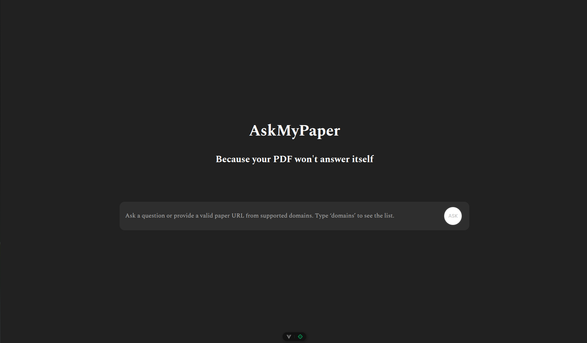

# Spider ML Task 2

## AskMyPaper (Task 2 - A)

**AskMyPaper** is an AI-powered web application that allows users to interact with research papers in natural language. It employs Retrieval-Augmented Generation (RAG) to return contextual answers directly from scholarly PDFs.

### Features

- Upload and parse credible research PDFs
- Automatically embed paper chunks into a vector store (Chroma)
- Ask questions and get accurate, source-backed answers
- Animated frontend replies, responsive dark UI
- Uses Vue 3 + FastAPI with Google Gemini & LangChain backend

### RAG Pipeline Overview

1. PDF uploaded → parsed into clean chunks
2. Chunks embedded and stored in **Chroma DB**
3. User question triggers vector search
4. Retrieved chunks are passed to **Gemini 2.0 Flash**
5. Answer is generated with full context

### Tech Stack

**Frontend**: Vue 3, Vite, Axios, CSS
**Backend**: FastAPI, LangChain, Chroma, Gemini API

---

## Food-101 Image Classification (Task 2 - B)

This subtask involves training a deep CNN on the **Food-101** dataset, which includes 101 food categories and over 100K images. The aim is to classify food types with high visual variability.

### Highlights

- Trained with PyTorch using **ResNet-34**
- Label smoothing + OneCycleLR scheduler
- Clean architecture & logging
- Achieved over **57% test accuracy** within 10 epochs

### Final Performance: Food101_v1_ResNet34

| Epoch | Train Accuracy | Test Accuracy |
|-------|----------------|----------------|
| 10    | 86.12%         | **57.28%**     |

---

## News Category Classification (Task 2 - C)

This task focuses on multi-class news classification from both the **headline** and **short description** of articles.

### Model Architecture: DCAF-RNN

**DCAF-RNN** stands for **Dual-Channel Attention Fusion Recurrent Neural Network**. It processes both the headline and description separately using a CNN + BiRNN pipeline, followed by cross-attention and gated fusion. Key elements:

- **Embedding Layer** with projection
- **CNN** for local feature extraction
- **Bidirectional RNN (vanilla)** per input
- **Cross Attention**: Headline attends to Description and vice versa
- **Gated Fusion**: Learns how much to weigh headline vs description
- **Final MLP Classifier** for multi-class output

### Variants Trained for RNN:

| Model Variant                 | Accuracy |
|-------------------------------|----------|
| DCAF-RNN (with class weights) | 54.71%   |
| DCAF-RNN (without weights)    | 64.07% |
| MLP Ensemble of both above    | **75.31%** |

>The **ensemble** leveraged complementary learning from both models, demonstrating how gating and fusion improve class separation.

---

### Variants Trained for LSTM:

| Model Variant                  | Accuracy   |
|--------------------------------|------------|
| DCAF-LSTM (with class weights) | 56.87%     |
| DCAF-LSTM (without weights)    | 63.76%     |
| MLP Ensemble of both above     | **64.36%** |

>The DCAF-LSTM without weights outperformed DCAF-LSTM with weights in almost 35 categories. So The Ensembling was not as efficient as the RNN one where both the models covered the entire categories
---

### BERT:

| Model Variant | Accuracy   |
|---------------|------------|
| TinyBERT      | **94.21%** |

>TinyBERT was Used. DistilBERT or BERT Base would have performed significantly better. But due to computing deficiencies, Trained on TinyBERT
---